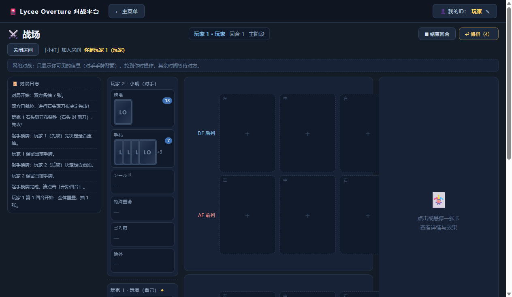

# Lycee Overture 对战平台

**Lycee Overture（リセ・オーバーチュア）非官方同人网络对战平台** — Windows 桌面客户端 + 自建联机中继服务器。

An **unofficial, fan-made** online battle platform for the Lycee Overture trading card game.
Electron + React + TypeScript desktop client, with a tiny self-hostable relay server for online play.

> ⚠️ **免责声明 / Disclaimer**
> 本项目是非官方粉丝作品，与 Lycee 的版权方（KADOKAWA / 富士見書房 / Lycee 官方）**没有任何关系**。
> 仓库内**不含**卡图、角色语音、音乐等版权素材，这些素材请自行准备（见「素材准备」一节），
> 版权归各自权利人所有。请勿将本项目用于任何商业用途。
>
> This is an unofficial fan project, not affiliated with the rights holders of Lycee Overture.
> This repository contains **no copyrighted assets** (card images, voice lines, music). You must supply
> those yourself (see "Assets"). All rights belong to their respective owners. Non-commercial use only.

---

## 界面 / Screenshot



> 联机对局界面：左侧对战日志、两侧玩家区域与 ID、顶部回合信息、右侧卡牌详情。

---

## 功能 / Features

| | |
|---|---|
| 🌐 联机对战 | 房间列表 / 创建房间 / 加入房间 / 观战席；房主权威（规则运算在房主端，服务器只转发） |
| 🃏 卡组 | 卡组制作（同编号最多 4 张、上限 60 张）、卡组码导入导出、进房后再选卡组 |
| 👤 玩家 ID | 右上角设置昵称，房间与对局中都能分清谁是谁 |
| 📜 规则引擎 | 登场 / 宣言 / 手札宣言 / 切札 / 对应宣言链 / 战斗（支援·护盾·伤害破弃）/ 移动类基本能力 / 诱发效果链 |
| ↩️ 悔棋 | 联机悔棋（需对方同意） |
| 🎵 战歌 | 发动切札时播放卡组绑定的音乐（跟着卡组保存） |
| 🎤 语音台词 | 16 种行为各有台词（回合开始/抽卡/登场/装备/地板/宣言/对应宣言/支援/攻击/防御/受伤/四种移动/切札），跟着卡组绑定 |
| ⚡ 增量同步 | 对局状态只发改动部分（实测整份 126KB → 平均 0.8KB，**减少 99.4% 流量**），带版本号与自动重同步 |
| ✅ 操作确认 | 客机操作带编号与版本号，房主回执后才解锁；画面过期会自动重对齐并提示重新操作 |
| 🔒 校验码 | 每个状态包带整份状态校验码（类似魔兽争霸自定义地图的"不同步"检测），另有每 5 秒的迷你心跳比对 |
| 🔍 同步诊断 | 底部状态栏显示：往返延迟 / 状态版本 / 校验码 / 待确认操作 / 对方是否已同步（点开看最近 10 个包） |
| 🧪 测试 | 5 套自动化测试共 **389 条断言**（规则 314 / 增量同步 22 / 语音映射 22 / 语音接线 20 / 中继协议 11） |

### 联机同步是怎么保证不出错的

公网往返延迟通常在 100~400ms（还有抖动），如果放任不管，会出现"点了没反应""AP 修正留到下一回合""手牌看着不对"这类怪象。三层防护：

1. **操作确认（预防）**：客机的每个操作带 `opId`（房主按它去重，连点/重发不会执行两次）和 `rev`（我基于哪一版点的）。房主处理完回执 `ack`；如果客机的画面已经过期，房主**不静默拒绝**，而是回 `reason:'stale'`，客机自动重对齐并提示"请重新操作"。界面上会显示「⏳ 等待房主确认」。
2. **漏包自愈（纠正）**：状态包带连续版本号与发包序号，客机发现对不上就立刻请求整份；房主另有每 5 秒一次的迷你心跳（只带版本号 + 校验码，约 50 字节）。
3. **校验码（体检）**：每个包带整份状态的校验码，客机应用后自己算一遍比对。第一次不一致 → 自动要整份重对齐；整份之后仍不一致 = 真·分车，客机把逐槽位校验值发回房主，房主算出**是哪个字段不一致**并广播，两边界面红字提示（例：`⚠ 不同步（分车）：分歧字段 players.1.field`）。

---

## 快速开始（开发者）/ Quick start

要求 **Node.js 20+**（开发环境用 Node 22/24 测试通过）。

```bash
git clone https://github.com/hifumioshi/lycee-overture-battle.git
cd lycee-overture-battle
npm install

# 拉取卡牌数据 + 卡图（约 80MB，写入 data/ 与 public/）
node tools/download-cards.mjs --from 6845 --to 6971

# 开发模式（Vite + Electron，改代码即时刷新）
npm run dev
```

> 当前卡池为测试区间 **LO-6845 ~ LO-6971**（208 张，全 EX2）。
> 换区间：改 `download-cards.mjs` 的 `--from/--to`，并同步调整应用读取的卡池范围。

### 打包 / Build

```bash
npm run build     # 构建渲染端 + 主进程
npm run dist      # electron-builder 打成 Windows 便携版（输出 release/）
```

### 测试 / Tests

```bash
npx tsc --noEmit                         # 渲染端类型检查
npx tsc -p tsconfig.electron.json --noEmit
npx tsx tools/test-rules.ts              # 规则引擎（314）
npx tsx tools/test-gssync.ts             # 增量同步（11）
npx tsx tools/test-voice.ts              # 语音映射（23）
npx tsx tools/test-voice-actions.ts      # 语音行为接线（20）
npx tsx tools/test-relay.mjs             # 中继协议（11）
```

推送代码时 GitHub Actions 会自动跑这些（见 `.github/workflows/ci.yml`）。

---

## 联机 / Online play

### 自己开服务器（推荐，2 分钟）

中继服务器只有一个文件 `server/index.js`（Node + `ws`），**不参与规则运算**，只负责「房间列表 + 消息转发」：

```bash
mkdir lycee-server && cd lycee-server
npm init -y && npm i ws
cp /path/to/lycee-overture-battle/server/index.js .
node index.js 9600        # 启动，默认端口 9600
```

Linux 上常驻 + 开机自启：

```bash
npm i -g pm2
pm2 start index.js --name lycee-relay
pm2 save
pm2 startup systemd       # 按提示执行它打印的那一行命令
```

别忘了在云服务商控制台的**防火墙**放行 TCP 9600。

### 让客户端连你的服务器

在客户端程序目录下新建 `data/relay.txt`，写入一行 `你的IP:端口`：

```
203.0.113.10:9600
```

客户端连接顺序：`data/relay.txt` → 内置默认地址 → `127.0.0.1:9600`（本机调试）。
本机调试也可以直接双击项目根目录的 `启动中继服务器.bat`。

---

## 素材准备 / Assets

仓库**不包含**以下版权素材，请自行放入对应目录：

| 目录 | 内容 | 获取方式 |
|---|---|---|
| `data/cards/range.json` | 卡牌数据 JSON | **仓库已包含**，方便直接跑测试 |
| `data/images/` | 卡图 PNG | `node tools/download-cards.mjs --from 6845 --to 6971`（自动从官网抓取） |
| `data/songs/` | 战歌音乐（`mp3/wav/ogg/m4a`，**文件名即界面里的选项名**） | 自行准备 |
| `data/voices/<语音包名>/<行为>/` | 角色语音，例如 `data/voices/风千 伪/回合开始/わたしのターン.m4a` | 自行准备 |

语音包的「行为」文件夹名支持别名（`回合开始` / `ターン開始`、`切扎` / `切札`、`移动` / `ステップ` …），
映射表在 `src/core/voice.ts` —— **加一行就能扩展新种类**。

---

## 目录结构 / Layout

```
src/
  core/        规则引擎（纯逻辑、可单测）：rules / effectEngine / clauses / game / room / voice / cost …
  net/         联机协议、中继客户端、增量同步（gsSync）
  ui/          React 界面：主菜单 / 卡组制作 / 多人游戏 / 房间大厅 / 战场
  types/       preload 暴露的 API 类型
electron/      主进程：窗口、自定义协议（song:// voice://）、IPC
server/        中继服务器（单文件，可独立部署）
tools/         卡牌下载工具 + 5 套测试
```

---

## 贡献 / Contributing

欢迎一起维护，尤其是**规则修正**（某张卡效果不触发、结算顺序不对之类）：

1. Fork 本仓库，切分支（`fix/xxx` 或 `feat/xxx`）
2. 改完**先跑测试**（见上），新增规则请顺手加一条断言
3. 提交 PR：写明 **卡号 + 现象 + 规则依据**（规则书截图 / 判例链接更佳）

> 规则最容易出错的是**诱发顺序**与**时点过滤**，改动时请确认 `tools/test-rules.ts` 全绿。

---

## 许可证 / License

[MIT](LICENSE)
